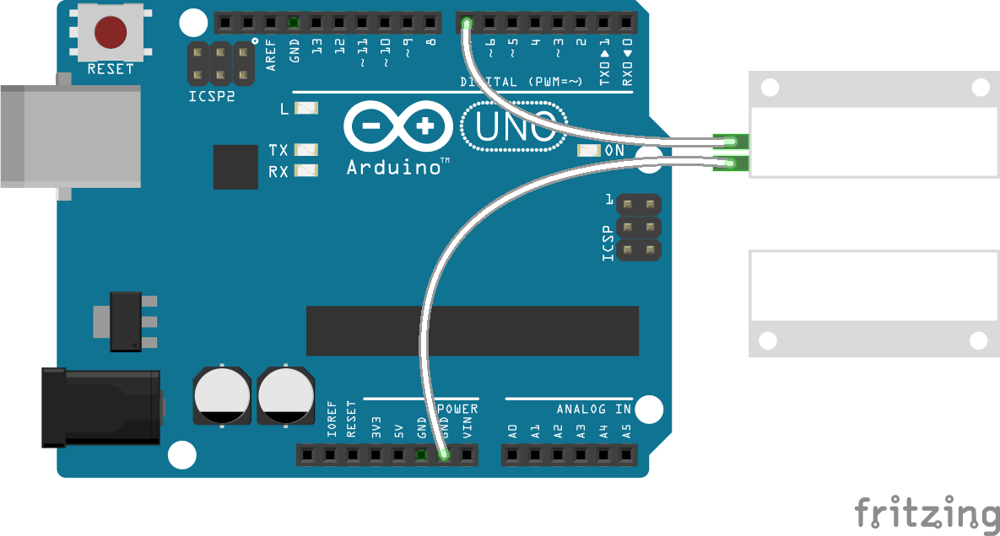

<!--remove-start-->

# Switch - Magnetic Door

<!--remove-end-->


##### Breadboard for "Switch - Magnetic Door"


<br>

Fritzing diagram: [docs/breadboard/switch-magnetic-door.fzz](breadboard/switch-magnetic-door.fzz)

&nbsp;


Run this example from the command line with:
```bash
node eg/switch-magnetic-door.js
```


```javascript
var five = require("johnny-five");
var board = new five.Board();

board.on("ready", function() {
  // Contact Mode: Normally Open (default!)
  var sw = new five.Switch(7);

  sw.on("open", function() {
    console.log("open");
  });

  sw.on("close", function() {
    console.log("close");
  });
});

```


## Learn More

- [Magnetic Door Switch](https://www.sparkfun.com/products/13247)

&nbsp;

<!--remove-start-->

## License
Copyright (c) 2012-2014 Rick Waldron <waldron.rick@gmail.com>
Licensed under the MIT license.
Copyright (c) 2015-2019 The Johnny-Five Contributors
Licensed under the MIT license.

<!--remove-end-->
