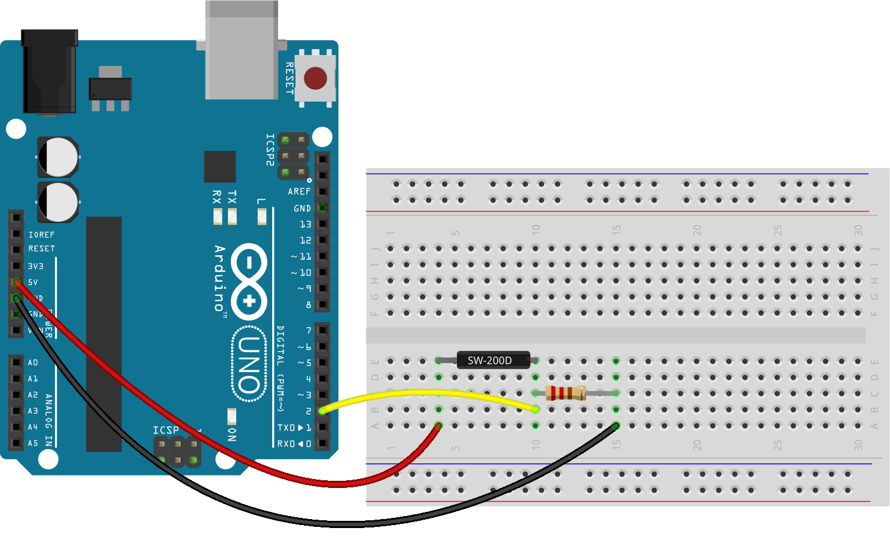

<!--remove-start-->

# Switch - Tilt SW-200D

<!--remove-end-->


##### Breadboard for "Switch - Tilt SW-200D"


<br>

Fritzing diagram: [docs/breadboard/switch-tilt-SW_200D.fzz](breadboard/switch-tilt-SW_200D.fzz)

&nbsp;


Run this example from the command line with:
```bash
node eg/switch-tilt-SW_200D.js
```


```javascript
const {Board, Button} = require("johnny-five");
const board = new Board();

board.on("ready", () => {
  const tilt = new Button(2); // digital pin 2

  board.repl.inject({
    button: tilt
  });

  // tilt the breadboard to the right, towards to the ground pin
  tilt.on("down", () => console.log("down"));

  // tilt and hold
  tilt.on("hold", () => console.log("hold"));

  // tilt back the breadboard to the stable position
  tilt.on("up", () => console.log("up"));
});

```


&nbsp;

<!--remove-start-->

## License
Copyright (c) 2012-2014 Rick Waldron <waldron.rick@gmail.com>
Licensed under the MIT license.
Copyright (c) 2015-2020 The Johnny-Five Contributors
Licensed under the MIT license.

<!--remove-end-->
