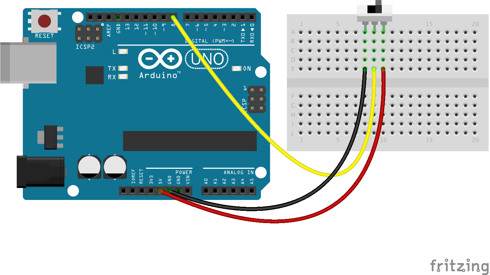
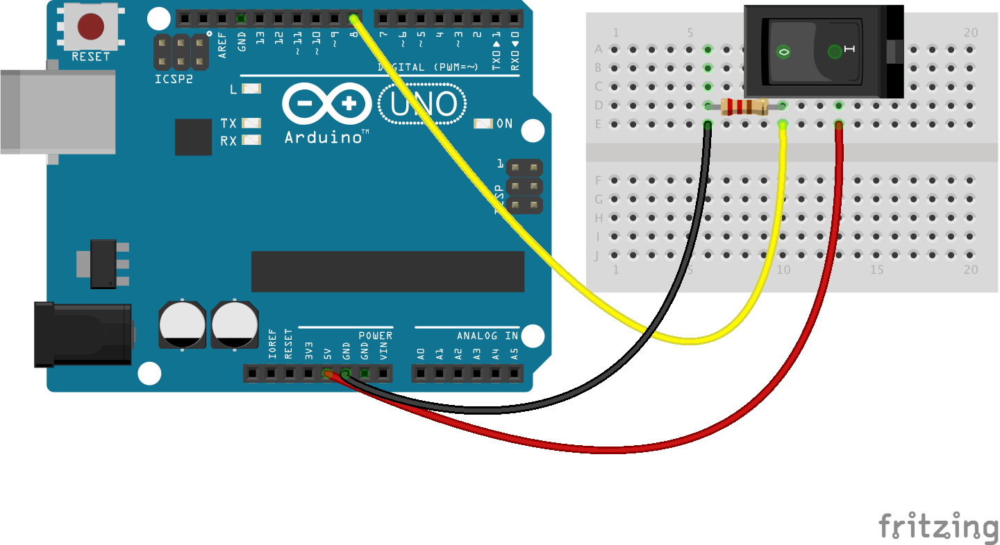

<!--remove-start-->

# Switch


Run with:
```bash
node eg/switch.js
```

<!--remove-end-->

```javascript
var five = require("johnny-five");
var board = new five.Board();

board.on("ready", function() {
  var spdt = new five.Switch(8);
  var led = new five.Led(13);

  spdt.on("open", function() {
    led.off();
  });

  spdt.on("close", function() {
    led.on();
  });
});

```


## Illustrations / Photos


### Switch - SPDT


<br>

Fritzing diagram: [docs/breadboard/switch-spdt.fzz](breadboard/switch-spdt.fzz)

&nbsp;
### Switch - SPST


<br>

Fritzing diagram: [docs/breadboard/switch-spst-rocker.fzz](breadboard/switch-spst-rocker.fzz)

&nbsp;


&nbsp;

<!--remove-start-->

## License
Copyright (c) 2012, 2013, 2014 Rick Waldron <waldron.rick@gmail.com>
Licensed under the MIT license.
Copyright (c) 2014, 2015 The Johnny-Five Contributors
Licensed under the MIT license.

<!--remove-end-->
