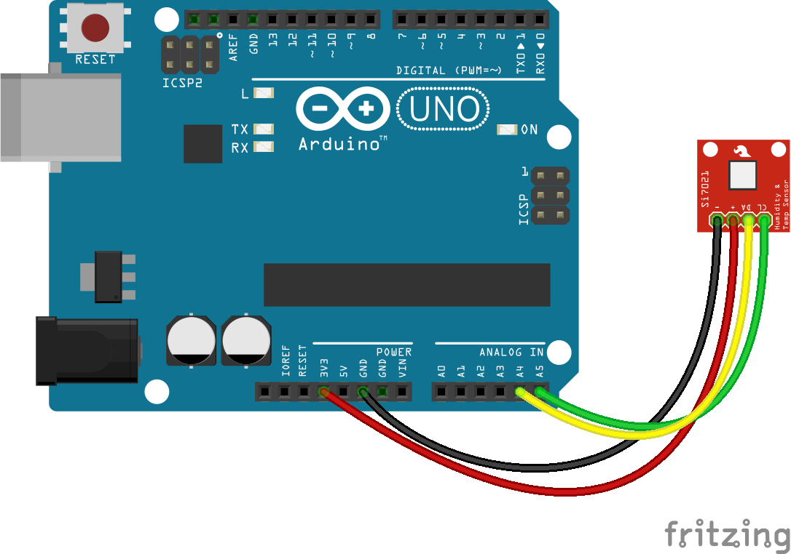

<!--remove-start-->

# Thermometer - SI7021

<!--remove-end-->


##### Tessel with SI7021


<br>

Fritzing diagram: [docs/breadboard/multi-SI7021.fzz](breadboard/multi-SI7021.fzz)

&nbsp;


Run this example from the command line with:
```bash
node eg/temperature-SI7021.js
```


```javascript
const { Board, Thermometer } = require("johnny-five");
const Tessel = require("tessel-io");

const board = new Board({
  io: new Tessel()
});

board.on("ready", () => {
  const thermometer = new Thermometer({
    controller: "SI7021",
    port: "A"
  });

  thermometer.on("change", () => {
    const {celsius, fahrenheit, kelvin} = thermometer;
    console.log("Thermometer");
    console.log("  celsius      : ", celsius);
    console.log("  fahrenheit   : ", fahrenheit);
    console.log("  kelvin       : ", kelvin);
    console.log("--------------------------------------");
  });
});


```


## Illustrations / Photos


##### Arduino with SI7021


<br>

Fritzing diagram: [docs/breadboard/multi-SI7021-uno.fzz](breadboard/multi-SI7021-uno.fzz)

&nbsp;


## Learn More

- [Si7021 Humidity and Temperature Sensor Hookup Guide](https://learn.sparkfun.com/tutorials/si7021-humidity-and-temperature-sensor-hookup-guide)

&nbsp;

<!--remove-start-->

## License
Copyright (c) 2012-2014 Rick Waldron <waldron.rick@gmail.com>
Licensed under the MIT license.
Copyright (c) 2015-2020 The Johnny-Five Contributors
Licensed under the MIT license.

<!--remove-end-->
