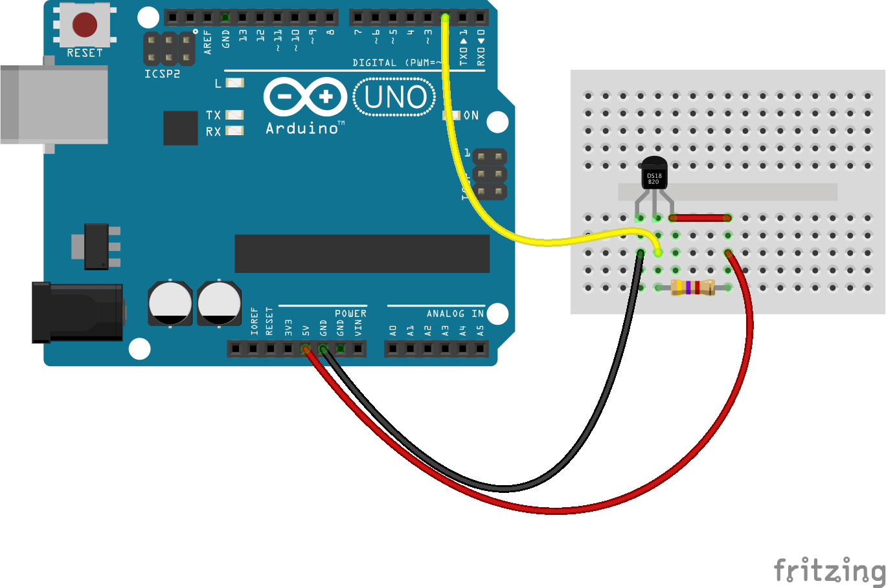

<!--remove-start-->

# Thermometer - DS18B20

<!--remove-end-->


##### Breadboard for "Thermometer - DS18B20"


<br>

Fritzing diagram: [docs/breadboard/temperature-ds18b20.fzz](breadboard/temperature-ds18b20.fzz)

&nbsp;


Run this example from the command line with:
```bash
node eg/temperature-ds18b20.js
```


```javascript
const { Board, Thermometer } = require("johnny-five");
const board = new Board();

board.on("ready", () => {
  // This requires OneWire support using ConfigurableFirmata
  const thermometer = new Thermometer({
    controller: "DS18B20",
    pin: 2
  });

  thermometer.on("change", () => {
    const {address, celsius, fahrenheit, kelvin} = thermometer;
    console.log(`Thermometer at address: 0x${address.toString(16)}`);
    console.log("  celsius      : ", celsius);
    console.log("  fahrenheit   : ", fahrenheit);
    console.log("  kelvin       : ", kelvin);
    console.log("--------------------------------------");
  });
});


```


## Additional Notes
- [DS18B20 - Thermometer Sensor](http://www.maximintegrated.com/en/products/analog/sensors-and-sensor-interface/DS18S20.html)

&nbsp;

<!--remove-start-->

## License
Copyright (c) 2012-2014 Rick Waldron <waldron.rick@gmail.com>
Licensed under the MIT license.
Copyright (c) 2015-2020 The Johnny-Five Contributors
Licensed under the MIT license.

<!--remove-end-->
