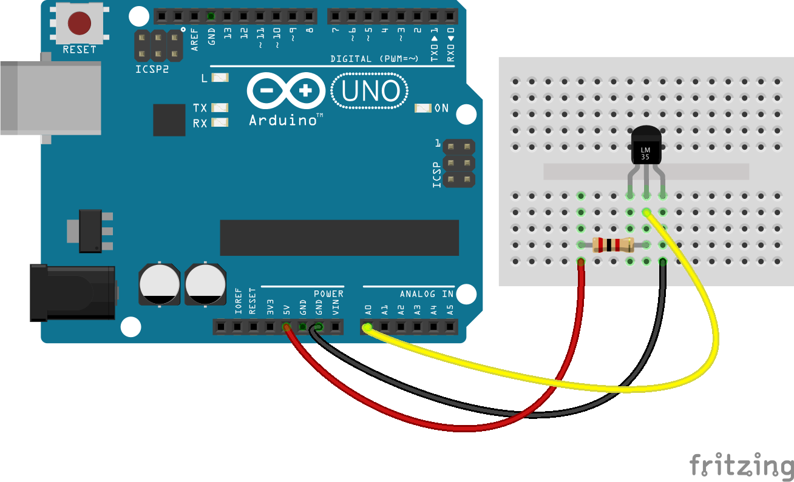

<!--remove-start-->

# Temperature - LM335

<!--remove-end-->


##### Breadboard for "Temperature - LM335"


<br>

Fritzing diagram: [docs/breadboard/temperature-lm335.fzz](breadboard/temperature-lm335.fzz)

&nbsp;


Run with:
```bash
node eg/temperature-lm335.js
```


```javascript
var five = require("johnny-five");

five.Board().on("ready", function() {
  var temperature = new five.Temperature({
    controller: "LM335",
    pin: "A0"
  });

  temperature.on("data", function(err, data) {
    console.log(data.celsius + "°C", data.fahrenheit + "°F");
  });
});

```


## Additional Notes
- [LM35 - Temperature Sensor](http://www.ti.com/product/lm35)

&nbsp;

<!--remove-start-->

## License
Copyright (c) 2012, 2013, 2014 Rick Waldron <waldron.rick@gmail.com>
Licensed under the MIT license.
Copyright (c) 2014, 2015 The Johnny-Five Contributors
Licensed under the MIT license.

<!--remove-end-->
