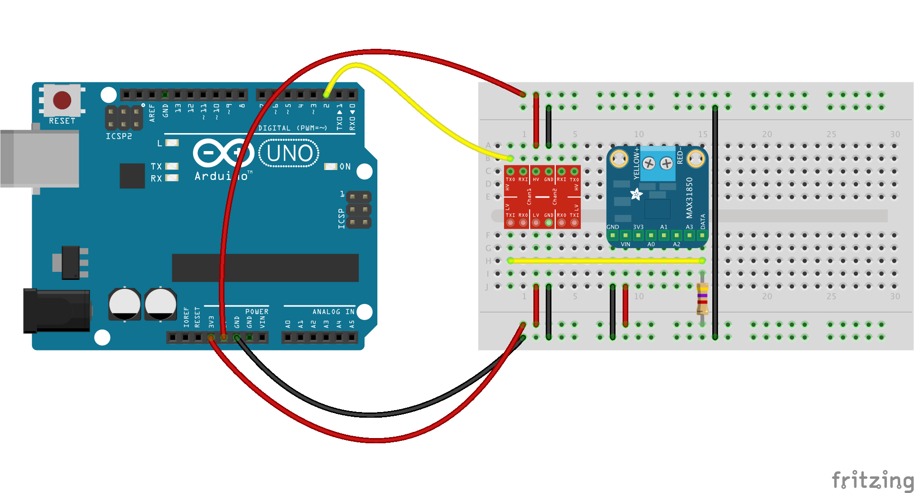

<!--remove-start-->

# Temperature - MAX31850

<!--remove-end-->


##### Breadboard for "Temperature - MAX31850"


<br>

Fritzing diagram: [docs/breadboard/temperature-max31850k.fzz](breadboard/temperature-max31850k.fzz)

&nbsp;


Run with:
```bash
node eg/temperature-max31850k.js
```


```javascript
var five = require("johnny-five");
var board = new five.Board();

board.on("ready", function() {
  // This requires OneWire support using the ConfigurableFirmata
  var temperature = new five.Temperature({
    controller: "MAX31850K",
    pin: 2
  });

  temperature.on("data", function() {
    console.log("temperature");
    console.log("  celsius      : ", this.celsius);
    console.log("  fahrenheit   : ", this.fahrenheit);
    console.log("  kelvin       : ", this.kelvin);
    console.log("--------------------------------------");
  });
});


```


## Additional Notes
- [MAX31850K - Thermocouple Amplifier](https://www.adafruit.com/products/1727)

&nbsp;

<!--remove-start-->

## License
Copyright (c) 2012, 2013, 2014 Rick Waldron <waldron.rick@gmail.com>
Licensed under the MIT license.
Copyright (c) 2014, 2015 The Johnny-Five Contributors
Licensed under the MIT license.

<!--remove-end-->
