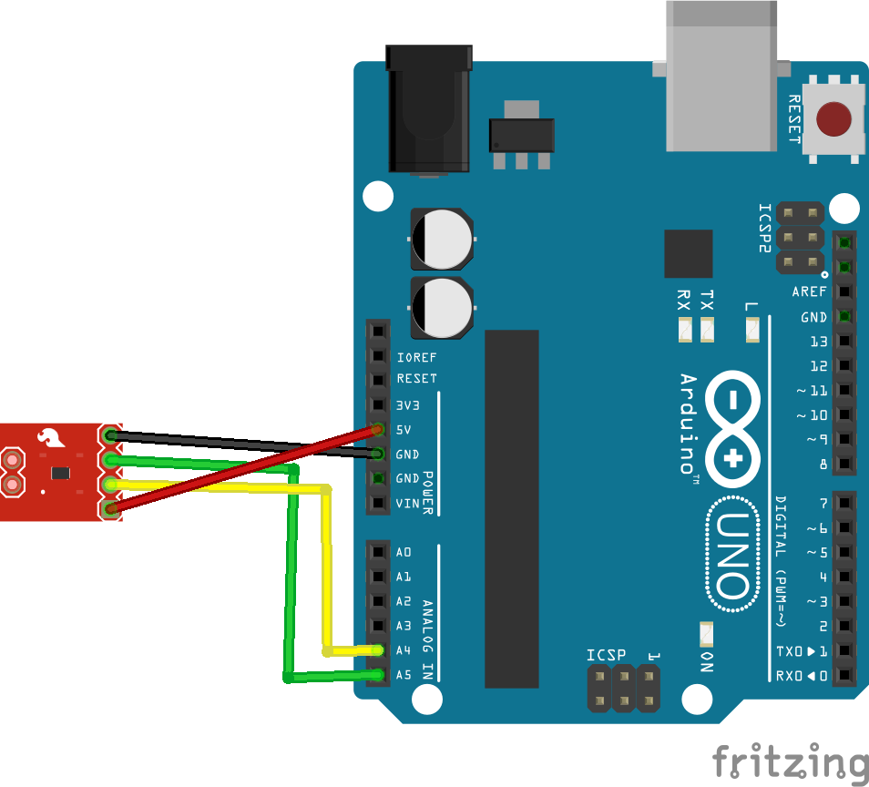

<!--remove-start-->

# Thermometer - TMP102

<!--remove-end-->


##### Breadboard for "Thermometer - TMP102"


<br>

Fritzing diagram: [docs/breadboard/temperature-tmp102.fzz](breadboard/temperature-tmp102.fzz)

&nbsp;


Run this example from the command line with:
```bash
node eg/temperature-tmp102.js
```


```javascript
const { Board, Thermometer } = require("johnny-five");
const board = new Board();

board.on("ready", () => {
  const thermometer = new Thermometer({
    controller: "TMP102"
  });

  thermometer.on("change", () => {
    const {celsius, fahrenheit, kelvin} = thermometer;
    console.log("Thermometer");
    console.log("  celsius      : ", celsius);
    console.log("  fahrenheit   : ", fahrenheit);
    console.log("  kelvin       : ", kelvin);
    console.log("--------------------------------------");
  });
});


```


## Additional Notes
- [TMP102 - Thermometer Sensor](https://www.sparkfun.com/products/11931)

&nbsp;

<!--remove-start-->

## License
Copyright (c) 2012-2014 Rick Waldron <waldron.rick@gmail.com>
Licensed under the MIT license.
Copyright (c) 2015-2020 The Johnny-Five Contributors
Licensed under the MIT license.

<!--remove-end-->
