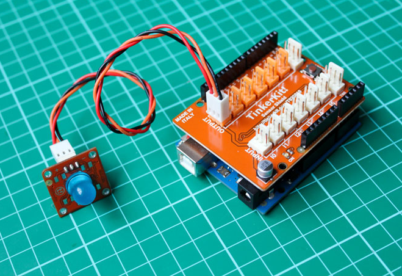

<!--remove-start-->

# TinkerKit - Blink

<!--remove-end-->


Run this example from the command line with:
```bash
node eg/tinkerkit-blink.js
```


```javascript
var five = require("johnny-five");
var board = new five.Board();

board.on("ready", function() {
  new five.Led("O0").strobe(250);
});

```


## Illustrations / Photos


### TinkerKit Blink


  


## Learn More

- [TinkerKit Led](http://tinkerkit.tihhs.nl/led-red-10mm/)

- [TinkerKit Shield](http://tinkerkit.tihhs.nl/shield/)

&nbsp;

<!--remove-start-->

## License
Copyright (c) 2012-2014 Rick Waldron <waldron.rick@gmail.com>
Licensed under the MIT license.
Copyright (c) 2015-2020 The Johnny-Five Contributors
Licensed under the MIT license.

<!--remove-end-->
