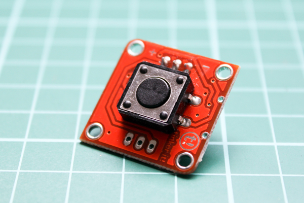

<!--remove-start-->

# TinkerKit - Button

<!--remove-end-->


Run this example from the command line with:
```bash
node eg/tinkerkit-button.js
```


```javascript
var five = require("johnny-five");
var board = new five.Board();

board.on("ready", function() {
  var touch = new five.Button({
    controller: "TINKERKIT",
    pin: "I0",
  });

  ["down", "up", "hold"].forEach(function(type) {
    touch.on(type, function() {
      console.log(type);
    });
  });
});

```


## Illustrations / Photos


### TinkerKit Button


  


## Learn More

- [TinkerKit Button](http://tinkerkit.tihhs.nl/button/)

- [TinkerKit Shield](http://tinkerkit.tihhs.nl/shield/)

&nbsp;

<!--remove-start-->

## License
Copyright (c) 2012-2014 Rick Waldron <waldron.rick@gmail.com>
Licensed under the MIT license.
Copyright (c) 2015-2020 The Johnny-Five Contributors
Licensed under the MIT license.

<!--remove-end-->
