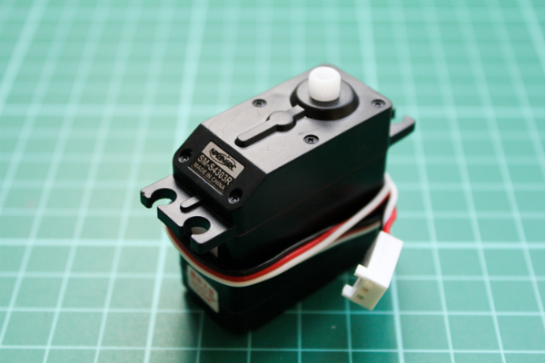

<!--remove-start-->

# TinkerKit - Continuous servo

<!--remove-end-->


Run this example from the command line with:
```bash
node eg/tinkerkit-continuous-servo.js
```


```javascript
var five = require("johnny-five");
var board = new five.Board();

board.on("ready", function() {
  var servo = new five.Servo({
    pin: "O0",
    type: "continuous"
  });

  new five.Sensor("I0").scale(0, 1).on("change", function() {
    servo.cw(this.value);
  });
});

```


## Illustrations / Photos


### TinkerKit Continuous Servo


  


## Learn More

- [TinkerKit Servo](http://tinkerkit.tihhs.nl/servo/)

- [TinkerKit Linear Potentiometer](http://tinkerkit.tihhs.nl/linear-pot/)

- [TinkerKit Shield](http://tinkerkit.tihhs.nl/shield/)

&nbsp;

<!--remove-start-->

## License
Copyright (c) 2012-2014 Rick Waldron <waldron.rick@gmail.com>
Licensed under the MIT license.
Copyright (c) 2015-2020 The Johnny-Five Contributors
Licensed under the MIT license.

<!--remove-end-->
