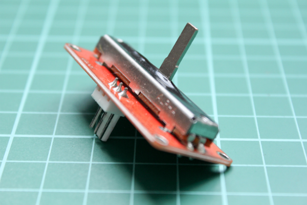

# Tinkerkit Linear Pot

Run with:
```bash
node eg/tinkerkit-linear-pot.js
```


```javascript
var five = require("johnny-five");

new five.Board().on("ready", function() {
  new five.Sensor("I0").scale(0, 100).on("read", function() {
    console.log( Math.round(this.value) );
  });
});


```

## Breadboard/Illustration




## Devices

- http://www.tinkerkit.com/linear-pot/
- http://www.tinkerkit.com/shield/


## Documentation

_(Nothing yet)_


## Contributing
All contributions must adhere to the [Idiomatic.js Style Guide](https://github.com/rwldrn/idiomatic.js),
by maintaining the existing coding style. Add unit tests for any new or changed functionality. Lint and test your code using [grunt](https://github.com/cowboy/grunt).

## Release History
_(Nothing yet)_

## License
Copyright (c) 2012 Rick Waldron <waldron.rick@gmail.com>
Licensed under the MIT license.
