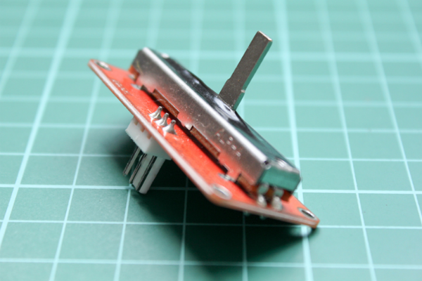

<!--remove-start-->

# TinkerKit - Linear potentiometer

<!--remove-end-->


Run this example from the command line with:
```bash
node eg/tinkerkit-linear-pot.js
```


```javascript
var five = require("johnny-five");
var board = new five.Board();

board.on("ready", function() {
  new five.Sensor("I0").scale(0, 255).on("data", function() {
    console.log(Math.round(this.value));
  });
});

```


## Illustrations / Photos


### TinkerKit Linear Potentiometer


  


## Learn More

- [TinkerKit Linear Potentiometer](http://tinkerkit.tihhs.nl/linear-pot/)

- [TinkerKit Shield](http://tinkerkit.tihhs.nl/shield/)

&nbsp;

<!--remove-start-->

## License
Copyright (c) 2012-2014 Rick Waldron <waldron.rick@gmail.com>
Licensed under the MIT license.
Copyright (c) 2015-2020 The Johnny-Five Contributors
Licensed under the MIT license.

<!--remove-end-->
