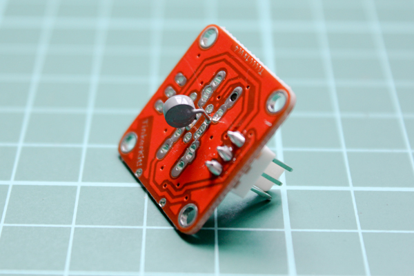

<!--remove-start-->

# TinkerKit - Temperature

<!--remove-end-->


Run with:
```bash
node eg/tinkerkit-thermistor.js
```


```javascript
var five = require("johnny-five");

new five.Board().on("ready", function() {
  new five.Thermometer({controller: "TINKERKIT", pin: "I0"}).on("change", function() {
    console.log("F: ", this.fahrenheit);
    console.log("C: ", this.celsius);
  });
});

```


## Illustrations / Photos


### TinkerKit Temperature


  


## Learn More

- [TinkerKit Thermistor](http://tinkerkit.tihhs.nl/thermistor/)

- [TinkerKit Shield](http://tinkerkit.tihhs.nl/shield/)

&nbsp;

<!--remove-start-->

## License
Copyright (c) 2012, 2013, 2014 Rick Waldron <waldron.rick@gmail.com>
Licensed under the MIT license.
Copyright (c) 2014, 2015 The Johnny-Five Contributors
Licensed under the MIT license.

<!--remove-end-->
