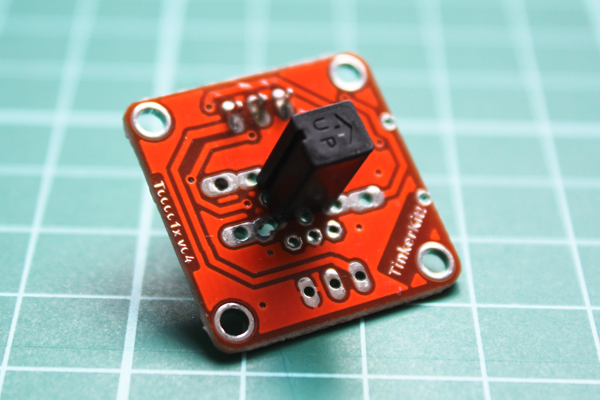

<!--remove-start-->

# TinkerKit - Tilt

<!--remove-end-->


Run this example from the command line with:
```bash
node eg/tinkerkit-tilt.js
```


```javascript
var five = require("johnny-five");
var board = new five.Board();

board.on("ready", function() {
  // var servo = new five.Servo("O0");

  new five.Sensor("I2").on("change", function() {
    console.log(this.boolean);
  });
});

```


## Illustrations / Photos


### TinkerKit Tilt


  


## Learn More

- [TinkerKit Servo](http://tinkerkit.tihhs.nl/servo/)

- [TinkerKit Tilt](http://tinkerkit.tihhs.nl/tilt-sensor/)

- [TinkerKit Shield](http://tinkerkit.tihhs.nl/shield/)

&nbsp;

<!--remove-start-->

## License
Copyright (c) 2012-2014 Rick Waldron <waldron.rick@gmail.com>
Licensed under the MIT license.
Copyright (c) 2015-2020 The Johnny-Five Contributors
Licensed under the MIT license.

<!--remove-end-->
