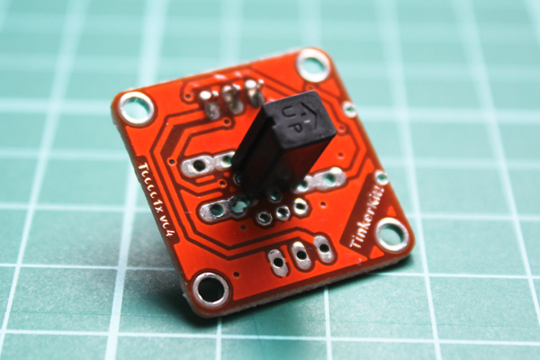

# Tinkerkit Tilt

Run with:
```bash
node eg/tinkerkit-tilt.js
```


```javascript
var five = require("johnny-five");

new five.Board().on("ready", function() {
  // var servo = new five.Servo("O0");

  new five.Sensor("I2").on("change", function() {
    console.log( this.boolean );
  });
});


```


## Breadboard/Illustration





- [TinkerKit Servo](http://www.tinkerkit.com/servo/)
- [TinkerKit Linear Potentiometer](http://www.tinkerkit.com/linear-pot/)
- [TinkerKit Shield](http://www.tinkerkit.com/shield/)


## Contributing
All contributions must adhere to the [Idiomatic.js Style Guide](https://github.com/rwldrn/idiomatic.js),
by maintaining the existing coding style. Add unit tests for any new or changed functionality. Lint and test your code using [grunt](https://github.com/cowboy/grunt).

## License
Copyright (c) 2012 Rick Waldron <waldron.rick@gmail.com>
Licensed under the MIT license.
