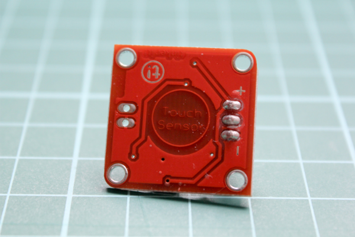

# Tinkerkit Touch

Run with:
```bash
node eg/tinkerkit-touch.js
```


```javascript
var five = require("johnny-five");

new five.Board().on("ready", function() {
  // Attaching to an O* pin in a deviation from
  // TinkerKit tutorials which instruct to attach
  // the touch to an I* pin.
  //
  // For the "touch" module, simply use a Button
  // instance, like this:
  var touch = new five.Button("O5");

  ["down", "up", "hold"].forEach(function(type) {
    touch.on(type, function() {
      console.log(type);
    });
  });
});


```


## Breadboard/Illustration




- [TinkerKit Touch](http://www.tinkerkit.com/touch/)
- [TinkerKit Shield](http://www.tinkerkit.com/shield/)


## License
Copyright (c) 2012-2013 Rick Waldron <waldron.rick@gmail.com>
Licensed under the MIT license.
Copyright (c) 2014 The Johnny-Five Contributors
Licensed under the MIT license.
