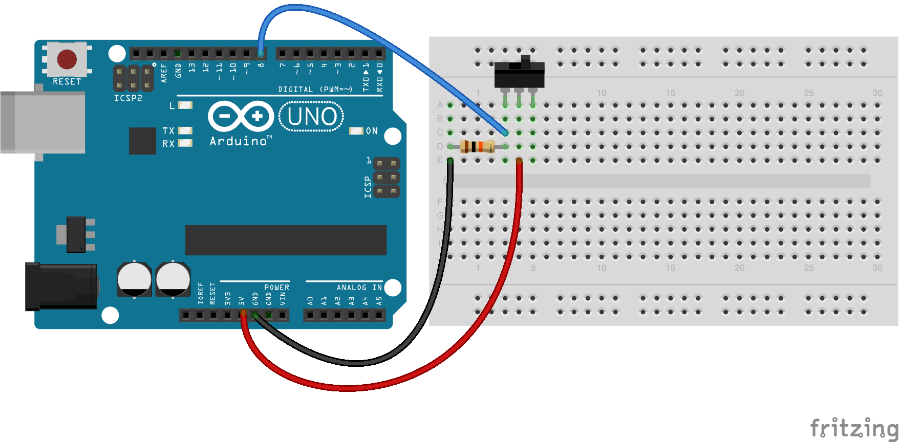

<!--remove-start-->

# Toggle Switch

<!--remove-end-->


##### Breadboard for "Toggle Switch"


<br>

Fritzing diagram: [docs/breadboard/toggle-switch.fzz](breadboard/toggle-switch.fzz)

&nbsp;


Run this example from the command line with:
```bash
node eg/toggle-switch.js
```


```javascript
var five = require("johnny-five");
var board = new five.Board();

board.on("ready", function() {

  // Create a new `switch` hardware instance.
  // This example allows the switch module to
  // create a completely default instance
  var toggle = new five.Switch(8);

  // Inject the `switch` hardware into
  // the Repl instance's context;
  // allows direct command line access
  board.repl.inject({
    toggle: toggle
  });

  // Switch Event API

  // "closed" the switch is closed
  toggle.on("close", function() {
    console.log("closed");
  });

  // "open" the switch is opened
  toggle.on("open", function() {
    console.log("open");
  });
});

```


&nbsp;

<!--remove-start-->

## License
Copyright (c) 2012-2014 Rick Waldron <waldron.rick@gmail.com>
Licensed under the MIT license.
Copyright (c) 2015-2020 The Johnny-Five Contributors
Licensed under the MIT license.

<!--remove-end-->
